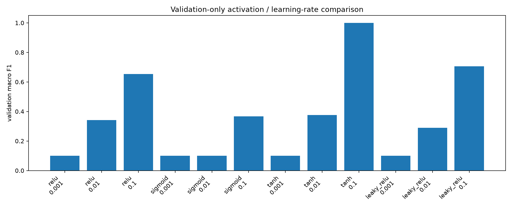
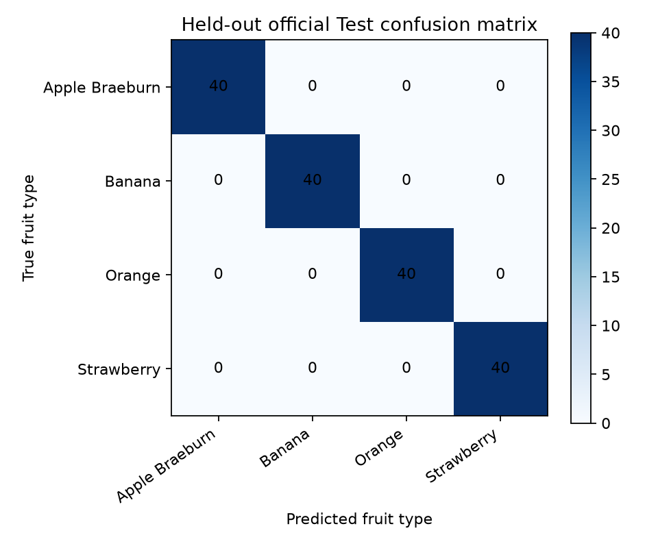

# Fruits-360 CNN Activation and Learning-Rate Experiment

## Scope and identity

This is a **provisional assignment experiment for fruit-type classification**. It is not the application's missing six-class fresh/rotten model and it must not be represented as freshness or spoilage detection.

The data came directly from the official public GitHub repository **Horea94/Fruit-Images-Dataset**, whose repository description identifies it as Fruits-360. Four exact repository class directories were used: `Apple Braeburn`, `Banana`, `Orange`, and `Strawberry`.

- Repository: https://github.com/Horea94/Fruit-Images-Dataset
- Training directories: https://github.com/Horea94/Fruit-Images-Dataset/tree/master/Training
- Test directories: https://github.com/Horea94/Fruit-Images-Dataset/tree/master/Test
- Repository licence: MIT, copyright Mihai Oltean and Horea Muresan: https://raw.githubusercontent.com/Horea94/Fruit-Images-Dataset/master/LICENSE

The repository licence is recorded as provenance information, not legal advice. The subset remains cached under `artifacts/experiment/data/` so the held-out files can be used for an end-to-end HTTP smoke test.

## Method

For each class, the first 100 lexicographically ordered official `Training` JPG files and first 40 official `Test` JPG files were downloaded. The 400 Training images alone were split reproducibly and per class into 320 training and 80 validation images (80/20). The 160 official Test images were kept separate. SHA-256 hashes were checked over all 560 selected files; no identical image occurred within or across these splits.

Images were converted to RGB and resized to 48×48. Every run used seed `20260919`, the same small architecture (Conv2D 8 → activation → max pool → Conv2D 16 → activation → global average pooling → 4-way softmax), sparse categorical cross-entropy, batch size 16, six epochs, and plain Keras SGD. The grid crossed ReLU, Sigmoid, Tanh, and LeakyReLU with learning rates 0.001, 0.01, and 0.1. Each run reset the random seed, giving the same initial trainable weights. Model selection used validation macro F1 only. The chosen configuration was then refit on training plus validation, and only that winner was evaluated on official Test.

## Executed results

| Activation | LR | Validation accuracy | Macro precision | Macro recall | Macro F1 |
|---|---:|---:|---:|---:|---:|
| ReLU | 0.001 | 0.2500 | 0.0625 | 0.2500 | 0.1000 |
| ReLU | 0.01 | 0.4500 | 0.3281 | 0.4500 | 0.3413 |
| ReLU | 0.1 | 0.7500 | 0.5929 | 0.7500 | 0.6540 |
| Sigmoid | 0.001 | 0.2500 | 0.0625 | 0.2500 | 0.1000 |
| Sigmoid | 0.01 | 0.2500 | 0.0625 | 0.2500 | 0.1000 |
| Sigmoid | 0.1 | 0.4875 | 0.3320 | 0.4875 | 0.3670 |
| Tanh | 0.001 | 0.2500 | 0.0625 | 0.2500 | 0.1000 |
| Tanh | 0.01 | 0.5000 | 0.3347 | 0.5000 | 0.3766 |
| **Tanh** | **0.1** | **1.0000** | **1.0000** | **1.0000** | **1.0000** |
| LeakyReLU | 0.001 | 0.2500 | 0.0625 | 0.2500 | 0.1000 |
| LeakyReLU | 0.01 | 0.3875 | 0.3225 | 0.3875 | 0.2898 |
| LeakyReLU | 0.1 | 0.7750 | 0.8515 | 0.7750 | 0.7064 |

The validation-selected winner was **Tanh with SGD learning rate 0.1**. After refitting, its one-time held-out official Test measurements on 160 images were: **accuracy 1.0000, macro precision 1.0000, macro recall 1.0000, and macro F1 1.0000**. These numbers are plausible for this narrow Fruits-360 subset with uniform backgrounds, but they are not evidence of real-world freshness performance.





Per-run training/validation loss and accuracy plots are in `artifacts/experiment/`, and exact full-precision results are in `summary.json`.

## Limitations

- Only four fruit-type classes and a deterministic 560-image subset were used; conclusions do not extend to all Fruits-360 classes.
- Adjacent Fruits-360 frames can be highly similar even when byte hashes differ. Hash deduplication prevents exact duplicates, not near-duplicate viewpoints or acquisition-session correlation.
- The official dataset has clean, centered objects and near-uniform backgrounds. A perfect subset score should not be treated as broad generalization.
- Only one seed, six epochs, one compact architecture, and three learning rates were tested.
- The final test metrics are a single evaluation of the validation-selected winner; the test set was not used for model selection.
- Assignment ownership of Fruits-360 was not independently confirmed, so this deliverable remains explicitly provisional.

## Reproduction

From the project root:

```bash
.venv/bin/python -m pytest experiments/test_cnn_experiments.py -q
.venv/bin/python experiments/run_fruits360_experiment.py --run
```

TensorFlow intra-op, inter-op, and OpenMP thread counts are bounded to two in the script. The saved winner accepts `(None, 48, 48, 3)` float RGB input and emits four probabilities in the exact order in `artifacts/experiment/class_names.json`.
